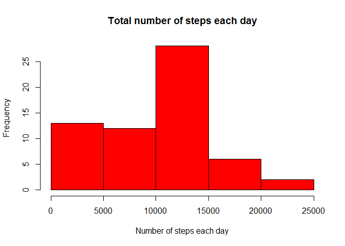
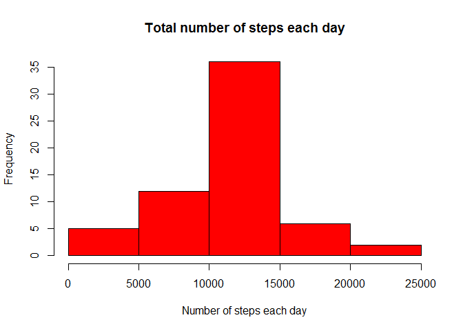

# Reproducible Research: Peer Assessment 1


## Loading and preprocessing the data

Read in the data

```r
data <- read.csv("activity/activity.csv")
```

## What is mean total number of steps taken per day?
Convert the dates to Date variables using as.Date

```r
data$date <- as.Date(data$date, format = "%Y-%m-%d")
```

Create new data frame to store total number of steps for each day

```r
x <- data.frame(matrix(nrow = 61, ncol = 2))
names(x) <- c("date","steps")
```

For each day in the interval 2012-10-01 to 2012-11-30, calculate the total number of steps

```r
#set initial date, then add 1 day at a time
currdate <- data[1,2]
for (i in 1:61) {
        #Pick a subset that only contains data for the current date
        currsubset <- subset(data, data$date == currdate)
        x[i,1] <- currdate
        x[i,2] <- sum(currsubset$steps, na.rm = TRUE)
        currdate <- currdate + 1
}
#Convert x$date back to date format
x$date <- as.Date(x$date, origin = "1970-01-01")
```

Plot the histogram

```r
hist(x$steps, col = "red", xlab = "Number of steps each day", ylab = "Frequency", main = "Total number of steps each day")
```

<!-- -->

Calculate the mean and median total number of steps

```r
meanx <- mean(x$steps, na.rm = TRUE)
medianx <- median(x$steps, na.rm = TRUE)
meanx
```

```
## [1] 9354.23
```

```r
medianx
```

```
## [1] 10395
```

## What is the average daily activity pattern?
Make a time series plot (i.e. type = "l") of the 5-minute interval (x-axis) and the average number of steps taken, averaged across all days (y-axis)

```r
#Identify the 5 minute intervals
intervals <- levels(factor(data$interval))
x2 <- data.frame(matrix(nrow = length(intervals), ncol = 2))
names(x2) = c("interval","average")

for (i in 1: length(intervals)) {
        #identify all observations for this 5 minute interval
        currsubset <- subset(data, data$interval == intervals[i])
        
        #average the number of steps in this subset
        x2[i,1] <- intervals[i]
        x2[i,2] <- mean(currsubset$steps, na.rm = TRUE)
}
#Plot these values
plot(intervals, x2$average, type="l",xlab = "interval",ylab = "average steps")
```

<!-- -->

Identify the interval with the maximum number of steps

```r
x2[which.max(x2$average),1]
```

```
## [1] "835"
```

## Imputing missing values

Count the number of NAs

```r
sum(is.na(data$steps))
```

```
## [1] 2304
```

Replace each NA with the average across all days for the 5-minute interval it belongs to.

```r
#Create new data frame
datanew <- data

for (i in 1:dim(datanew)[1]) {
        if(is.na(datanew[i,"steps"])) {
                #replace with average across all days for this interval
                #note we already have the data frame x2 with these desired averages
                #so just pick out the value for the current interval using the which fn
                datanew[i,"steps"] <- x2[which(x2$interval == datanew[i,"interval"]),2]
        }
}
```

Repeat steps from above to produce a histogram 


```r
xnew <- data.frame(matrix(nrow = 61, ncol = 2))
names(xnew) <- c("date","steps")

#set initial date, then add 1 day at a time
currdate <- datanew[1,2]
for (i in 1:61) {
        #Pick a subset that only contains data for the current date
        currsubset <- subset(datanew, datanew$date == currdate)
        xnew[i,1] <- currdate
        xnew[i,2] <- sum(currsubset$steps, na.rm = TRUE)
        currdate <- currdate + 1
}
#Convert x$date back to date format
xnew$date <- as.Date(xnew$date, origin = "1970-01-01")
```

Plot the histogram

```r
hist(xnew$steps, col = "red", xlab = "Number of steps each day", ylab = "Frequency", main = "Total number of steps each day")
```

<!-- -->

Calculate the mean and median total number of steps

```r
meanxnew <- mean(xnew$steps, na.rm = TRUE)
medianxnew <- median(xnew$steps, na.rm = TRUE)
meanxnew
```

```
## [1] 10766.19
```

```r
medianxnew
```

```
## [1] 10766.19
```

Using an estimate for missing values clearly alters the distribution. The peaks are enhanced, since we used averages to replace the missing values. Also our strategy of replacing NAs with the average for that interval across all days brought the mean and median closer together, and to the value 10766.19, which is the sum of averages of all intervals i.e. the sum of column 2 of data frame x2 calculated above.

## Are there differences in activity patterns between weekdays and weekends?

Add a new variable "weekvar"

```r
for (i in 1:dim(datanew)[1]) {
        if ((weekdays(datanew[i,"date"]) == "Sunday") | (weekdays(data[i,"date"]) == "Saturday")) {
                datanew[i,"weekvar"] <- "weekend"
        }
        else 
                datanew[i,"weekvar"] <- "weekday"
}

#Convert new variable to factor
datanew$weekvar <- factor(datanew$weekvar)
```

Average across weekdays and weekends separately

```r
xweek <- data.frame(matrix(nrow = (2*length(intervals)), ncol = 3))
names(xweek) = c("interval","average","weekvar")

for (i in 1: length(intervals)) {
        #identify all observations for this 5 minute interval
        currsubset1 <- subset(datanew, (datanew$interval == intervals[i] & datanew$weekvar == "weekday"))
        #average the number of steps in this subset
        xweek[2*(i-1)+1,1] <- intervals[i]
        xweek[2*(i-1)+1,2] <- mean(currsubset1$steps, na.rm = TRUE)
        xweek[2*(i-1)+1,3] <- "weekday"
        
        #identify all observations for this 5 minute interval
        currsubset2 <- subset(datanew, (datanew$interval == intervals[i] & datanew$weekvar == "weekend"))
        #average the number of steps in this subset
        xweek[2*(i-1)+2,1] <- intervals[i]
        xweek[2*(i-1)+2,2] <- mean(currsubset2$steps, na.rm = TRUE)
        xweek[2*(i-1)+2,3] <- "weekend"
}

xweek$weekvar <- factor(xweek$weekvar)
```

Plot this data frame (xweek) according to the factor weekvar

```r
library(lattice)
xyplot(average~as.numeric(interval) | weekvar, xweek, type = "l", layout = c(1,2), xlab = "Interval", ylab = "Number of steps")
```

<!-- -->
